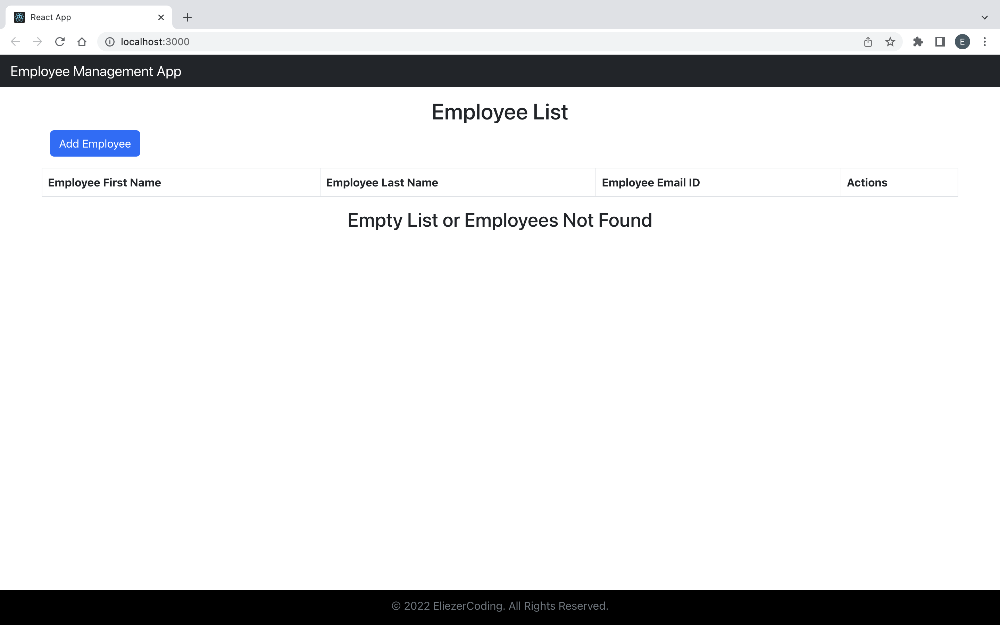
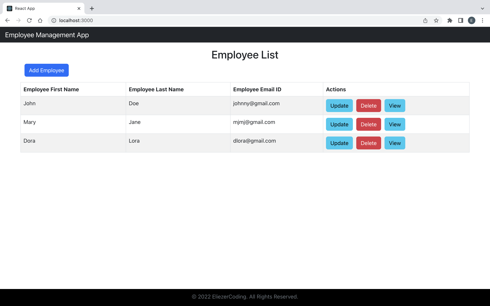
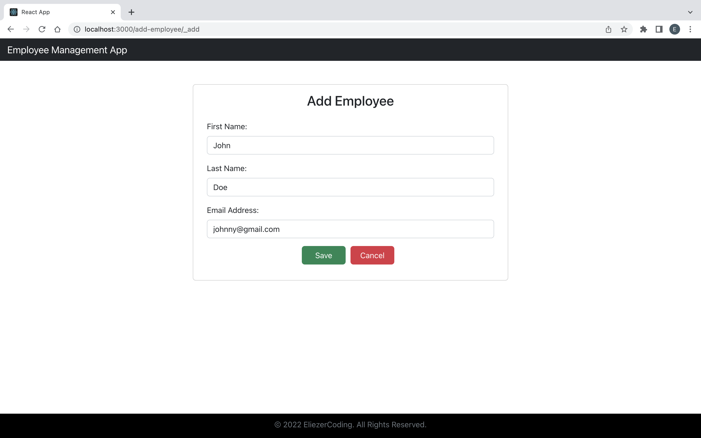
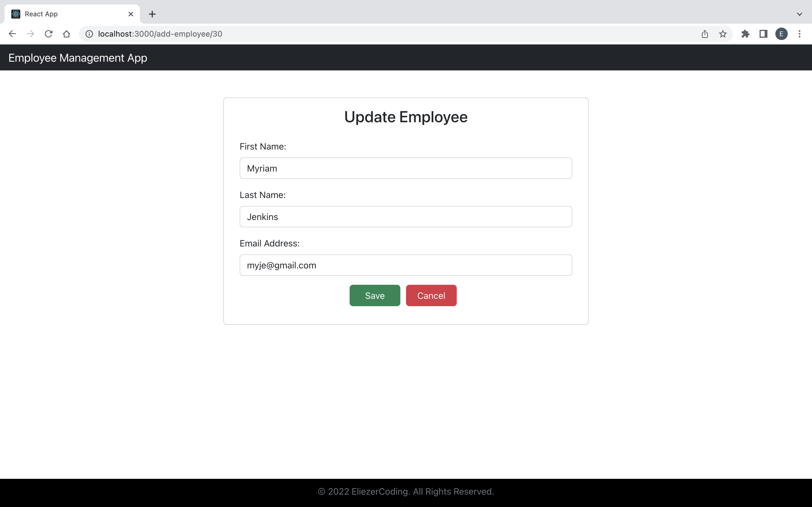
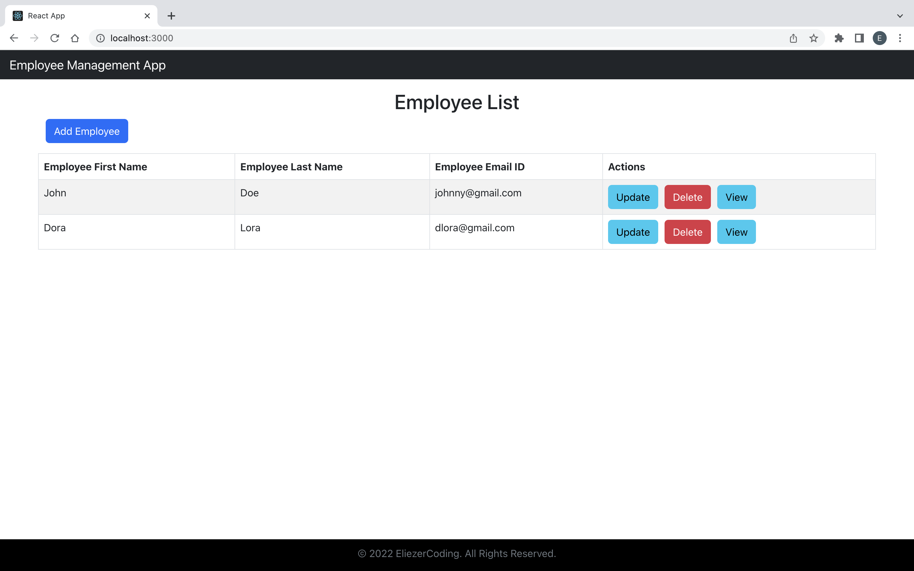
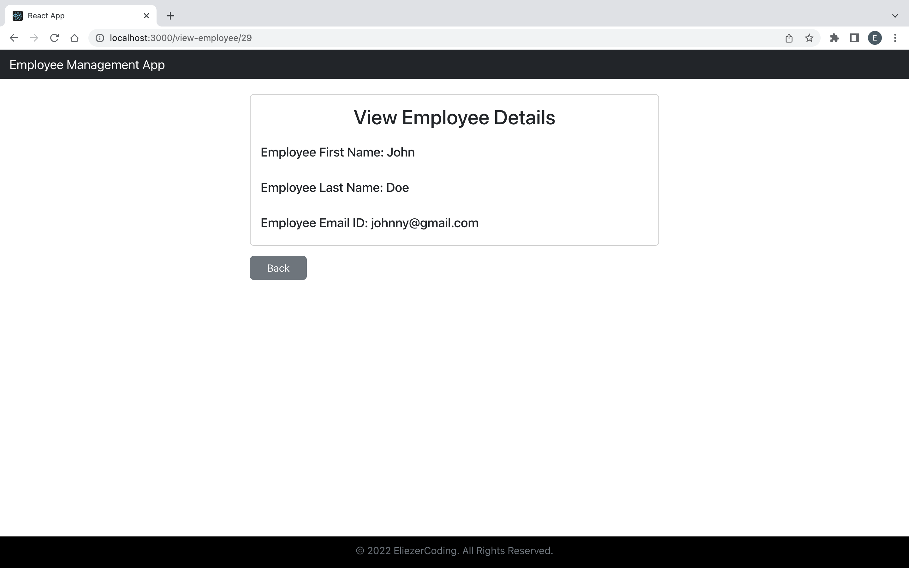

# employee-management
## Employee Management App (React + Spring Boot)
- **Front-End: JavaScript, React**
- **Back-End: Java, Spring Boot**
- **Database - MySQL**

> Home
>
>
>
>

>Add Employee
>
>

>Update Employee
>
>
>
>

>Delete Employee
>
>

>View Employee
>
>